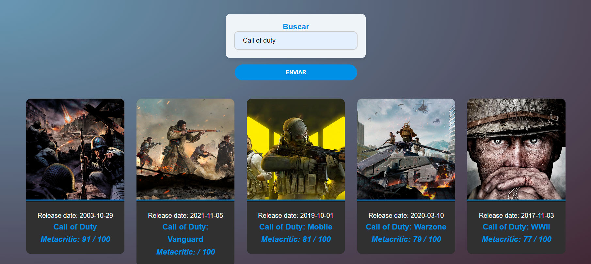

Una aplicación web desarrollada con **Angular** que se conecta a una **API de búsqueda de juegos**. Permite a los usuarios buscar títulos de videojuegos y obtener información detallada como:

- Título del juego
- Fecha de lanzamiento
- Puntuación en Metacritic
- Imagen de portada del juego


## Cómo Funciona
Introduce un título de videojuego en la barra de búsqueda.
La aplicación realiza una solicitud a la API externa para obtener los detalles del juego.

Los resultados se muestran con el título, fecha de lanzamiento, puntuación en Metacritic y la imagen de portada del juego.

### Ejemplo de Búsqueda:
#### Resultados de Búsqueda:



## Características

- **Funcionalidad de búsqueda**: Busca juegos por su título.
- **Visualización de información del juego**: Muestra la fecha de lanzamiento, puntuación en Metacritic y la imagen de portada.
- **Integración con API**: Obtiene datos de juegos mediante una API REST.

## Tecnologías Utilizadas

- **Angular**: Framework de frontend.
- **API REST**: Conexión con una base de datos externa de videojuegos.
- **TypeScript**: Uso de tipado fuerte para una estructura de código clara.
- **PHP**: Integración de ficheros PHP para hacer consulta API.

## Instalación

1. Clona el repositorio:
   ```bash
   git clone https://github.com/Swonk12/Game-Search-API.git
   cd Game-Search-API
   ```

2. Instala las dependencias:
    ```bash
    npm install
    ```
3. Ejecuta la aplicación:
    ```bash
    ng serve
    ```
4. Accede a la aplicación en ``http://localhost:4200``


